# ⛅ End-to-End Cloud Weather Data Pipeline
 
> A production-style data engineering pipeline that extracts real-time weather data for 10 major Indian cities every hour, transforms it through a multi-layer dbt model architecture, and serves analytics-ready tables to a live Looker Studio dashboard — all orchestrated by Apache Airflow running in Docker.
 


 
---
 
## What this project does
IndiaWeatherFlow is an end-to-end cloud data engineering pipeline that ingests real-time weather data for 10 Indian cities every hour via OpenWeatherMap API, orchestrated by Apache Airflow in Docker, and batch-loads validated JSON into Google BigQuery. A 3-layer dbt transformation architecture — staging, intermediate, and mart — produces analytics-ready tables powering a live Looker Studio dashboard with temperature trends, city comparisons, and 24-hour forecasts. The project includes GitHub Actions CI/CD with automated linting, pytest, and dbt model validation, plus a free Open-Meteo backfill utility for gap recovery.
Every hour, an Airflow DAG wakes up inside Docker, calls the OpenWeatherMap API for 10 Indian cities in parallel, validates the responses, and lands raw JSON files to a local data lake. A BigQuery loader then flattens and batch-loads those files into Google BigQuery. dbt transforms the raw data through three layers — staging, intermediate, and mart — producing clean, aggregated, analytics-ready tables. Looker Studio reads those tables directly from BigQuery and renders a live dashboard.
 
A historical backfill script using the free Open-Meteo API fills gaps for any dates the pipeline wasn't running.
# Architecture

# Extractor

## Overview

This project is a production-style, end-to-end data engineering pipeline that extracts weather data from the [OpenWeatherMap API](https://openweathermap.org/api) for 10 major Indian cities every hour, lands raw JSON to a cloud data lake, transforms it using dbt, and serves it via a BI dashboard.

Built as a portfolio project demonstrating real-world data engineering practices: orchestration, data quality checks, CI/CD, partitioned storage, and layered transformations.

---

## Architecture

```
┌─────────────────────────────────────────────────────────────────┐
│                        Source Layer                             │
│   OpenWeatherMap API  (/weather + /forecast endpoints)          │
└────────────────────────────┬────────────────────────────────────┘
                             │ JSON (hourly, 10 cities)
┌────────────────────────────▼────────────────────────────────────┐
│                      Ingestion Layer                            │
│   Apache Airflow DAG  →  extract + validate + land to lake      │
└──────────────┬──────────────────────────────┬───────────────────┘
               │                              │
┌──────────────▼──────────┐    ┌──────────────▼──────────────────┐
│      Data Lake          │    │         Data Warehouse           │
│   S3 / GCS / Local      │    │    BigQuery / Snowflake          │
│   raw/owm/current/      │    │    (loaded from lake)            │
│   raw/owm/forecast/     │    │                                  │
└─────────────────────────┘    └──────────────┬───────────────────┘
                                              │
                               ┌──────────────▼───────────────────┐
                               │      Transformation Layer        │
                               │   dbt: staging → mart models     │
                               │   data quality tests             │
                               └──────────────┬───────────────────┘
                                              │
                               ┌──────────────▼───────────────────┐
                               │        Dashboard / BI            │
                               │   Metabase / Apache Superset     │
                               └──────────────────────────────────┘
```

### Data flow per run
1. Airflow triggers at the top of every hour
2. Pre-flight check validates the API key is live
3. Current weather and 5-day forecast extracted in parallel for all 10 cities
4. Each payload validated (schema, temperature range, row count)
5. Raw JSON landed to `raw/owm/{endpoint}/city={name}/year=/month=/day=/hour/`
6. Quality gate asserts all 10 cities succeeded before marking run complete
7. Slack/email alert fires if any task fails
8. to check the full check : python loaders/pipeline_health_check.py
9.   Pipeline has gaps. Run these commands in order:
  a. python src/extract_weather.py
     Extracts raw JSON from OpenWeatherMap for all 10 cities
  b. python loaders/load_to_bigquery.py
     Batch-loads raw JSON files into BigQuery raw_weather dataset
  c. cd dbt && dbt run --select staging
     Rebuilds stg_current_weather and stg_forecast_weather views
  d. cd dbt && dbt run --select mart
     Rebuilds mart_city_weather_daily, mart_city_comparison,
     mart_forecast_next24h tables in mart_weather dataset
  After each step, re-run this script to verify progress:
  python loaders/pipeline_health_check.py
---

## Cities covered

| City | State |
|------|-------|
| Delhi | NCT |
| Mumbai | Maharashtra |
| Bengaluru | Karnataka |
| Prayagraj | Uttar Pradesh |
| Chennai | Tamil Nadu |
| Kolkata | West Bengal |
| Hyderabad | Telangana |
| Pune | Maharashtra |
| Jaipur | Rajasthan |
| Ahmedabad | Gujarat |

---

## Tech Stack

| Layer | Tool |
|-------|------|
| Orchestration | Apache Airflow 2.9 |
| Extraction | Python 3.10+, `requests` |
| Storage | AWS S3 / GCS / Local |
| Warehouse | BigQuery / Snowflake |
| Transformation | dbt Core |
| Data quality | Great Expectations |
| Containerisation | Docker + Docker Compose |
| CI/CD | GitHub Actions |
| Testing | pytest |
| Dashboard | Metabase / Apache Superset |

---

## Project Structure

```
end-to-end-weather-pipeline/
│
├── dags/
│   └── weather_pipeline_dag.py     # Airflow DAG (5 tasks, hourly)
│
├── src/
│   └── extract_weather.py          # Extraction, validation, storage logic
│
├── dbt/                            # (week 3) dbt transformation project
│   ├── models/
│   │   ├── staging/                # stg_current_weather, stg_forecast
│   │   ├── intermediate/           # int_weather_combined
│   │   └── mart/                   # mart_city_weather_daily
│   ├── tests/
│   └── dbt_project.yml
│
├── tests/
│   └── test_extract_weather.py     # 13 pytest unit tests
│
├── docs/
│   └── architecture.png            # Architecture diagram
│
├── .github/
│   └── workflows/
│       └── ci.yml                  # GitHub Actions: lint + test on push
│
├── data/
│   └── raw/                        # Local storage output (dev/testing)
│
├── config/
│   └── config.py                   # Centralised config constants
│
├── docker-compose.yml              # Airflow + Postgres local setup
├── requirements.txt
├── .env.example                    # Template — never commit .env
├── .gitignore
├── Makefile                        # Common commands
└── README.md
```

---

## Quickstart

### Prerequisites

- Python 3.10+
- Docker Desktop (running)
- Git
- A free [OpenWeatherMap API key](https://openweathermap.org/api) (free tier: 1,000 calls/day)

### 1. Clone the repo

```bash
git clone https://github.com/your-username/end-to-end-weather-pipeline.git
cd end-to-end-weather-pipeline
```

### 2. Create virtual environment

```bash
python -m venv .venv

# Windows
.venv\Scripts\activate

# Mac / Linux
source .venv/bin/activate
```

### 3. Install dependencies

```bash
pip install -r requirements.txt
```

### 4. Configure environment

```bash
cp .env.example .env
```

Open `.env` and fill in your values:

```env
OWM_API_KEY=your_openweathermap_api_key
STORAGE_BACKEND=local          # "local" | "s3" | "gcs"
LOCAL_OUTPUT_DIR=data          # data root — files land at data/raw/owm/
```

> **Note:** New OWM API keys take up to 2 hours to activate after signup.

### 5. Test the extractor locally

```bash
# Dry run — prints JSON to terminal, no upload
python src/extract_weather.py --dry-run --city Delhi

# Run all cities locally
python src/extract_weather.py
```

### 6. Run the tests

```bash
pytest tests/ -v
```

### 7. Start Airflow with Docker

```bash
# First time only — initialises DB and creates admin user
docker-compose up airflow-init

# Start all services
docker-compose up -d
```

Open [http://localhost:8080](http://localhost:8080) and log in:
- Username: `admin`
- Password: `admin`

Enable the `weather_pipeline` DAG and hit the play button. It runs every hour automatically.

---

## Airflow DAG

The DAG (`weather_pipeline`) contains 5 tasks:

```
start
  └── validate_api_key
        ├── extract_current   ─┐
        └── extract_forecast  ─┴── quality_checks
                                   └── notify_on_failure  (only on failure)
```

| Task | What it does |
|------|-------------|
| `validate_api_key` | Test call to OWM — fails fast if key is invalid |
| `extract_current` | Fetch `/weather` for all 10 cities, validate, land to lake |
| `extract_forecast` | Fetch `/forecast` for all 10 cities, validate, land to lake |
| `quality_checks` | Assert all 10 cities succeeded in both endpoints |
| `notify_on_failure` | Fires Slack/email alert on any upstream failure |

**Schedule:** `0 * * * *` (top of every hour)  
**Retries:** 2 retries with 5-minute delay  
**Dry run:** Trigger with config `{"dry_run": true}` to test without uploading

---

## Storage layout

Raw files land with Hive-style partitioning for efficient downstream querying:

```
data/raw/
└── owm/
    ├── current/
    │   └── city=delhi/
    │       └── year=2026/month=06/day=04/hour=10/
    │           └── delhi_20260604T100000Z.json
    └── forecast/
        └── city=delhi/
            └── year=2026/month=06/day=04/hour=10/
                └── delhi_20260604T100000Z.json
```

Each file is the raw API response with two extra fields added by the pipeline:
- `ingested_at` — UTC timestamp of when the pipeline ran
- `pipeline_city_query` — the city name used in the API call

---

## dbt Models (Week 3)

Transformations follow the staging → intermediate → mart pattern:

```
staging/
  stg_current_weather.sql     -- typed, renamed columns from raw
  stg_forecast.sql            -- exploded forecast intervals

intermediate/
  int_weather_combined.sql    -- joins current + forecast by city + date

mart/
  mart_city_weather_daily.sql -- daily aggregates: avg temp, max wind, etc.
```

Run dbt:

```bash
export GCP_PROJECT_ID="weather-pipeline-498519"
export GOOGLE_APPLICATION_CREDENTIALS="D:/JOB/Work/End-to-End Weather Pipeline/gcp-credentials.json"
cd dbt
dbt run
dbt test
dbt docs generate && dbt docs serve
```

---

## CI/CD

GitHub Actions runs on every push to `main`:

```yaml
on: [push, pull_request]
jobs:
  test:
    - Lint with ruff
    - Run pytest
    - dbt compile + dbt test
```

Add the badge to your README once the workflow is live:

```

```

---

## Environment variables reference

| Variable | Required | Description |
|----------|----------|-------------|
| `OWM_API_KEY` | Yes | OpenWeatherMap API key |
| `STORAGE_BACKEND` | Yes | `local`, `s3`, or `gcs` |
| `LOCAL_OUTPUT_DIR` | For local | Data root directory (files land at `{LOCAL_OUTPUT_DIR}/raw/owm/`) |
| `S3_BUCKET` | For S3 | AWS S3 bucket name |
| `GCS_BUCKET` | For GCS | GCP bucket name |
| `SLACK_WEBHOOK_URL` | Optional | Slack incoming webhook for alerts |

---

## Sample output

A single current weather record for Delhi:

```json
{
  "name": "Delhi",
  "dt": 1717488000,
  "coord": { "lat": 28.66, "lon": 77.23 },
  "main": {
    "temp": 38.5,
    "feels_like": 37.1,
    "temp_min": 36.0,
    "temp_max": 40.0,
    "humidity": 22,
    "pressure": 1002
  },
  "weather": [{ "main": "Clear", "description": "clear sky" }],
  "wind": { "speed": 4.1, "deg": 270 },
  "ingested_at": "2026-06-04T10:00:00+00:00",
  "pipeline_city_query": "Delhi"
}
```

---

## Roadmap

- [x] OpenWeatherMap extraction for 10 Indian cities
- [x] Airflow DAG with parallel tasks and quality checks
- [x] Local data lake with Hive-style partitioning
- [x] BigQuery batch loader (free-tier compatible)
- [x] dbt staging, intermediate, and mart models
- [x] Historical backfill via Open-Meteo
- [x] GitHub Actions CI/CD
- [x] Looker Studio dashboard
- [ ] Add load_to_bigquery as Airflow DAG task
- [ ] Deploy Airflow to Cloud Composer (GCP)
- [ ] Terraform for infrastructure as code
- [ ] Great Expectations full validation suite
- [ ] Slack alerting on pipeline failure
---

## License

MIT — free to use, fork, and build on.

---

## Author

Built by **[Prateek kharwar]** as part of a cloud data engineering portfolio.  
Connect on [LinkedIn](https://www.linkedin.com/in/prateek-kharwar-a7764b270/) · [GitHub](https://github.com/Khprateek)